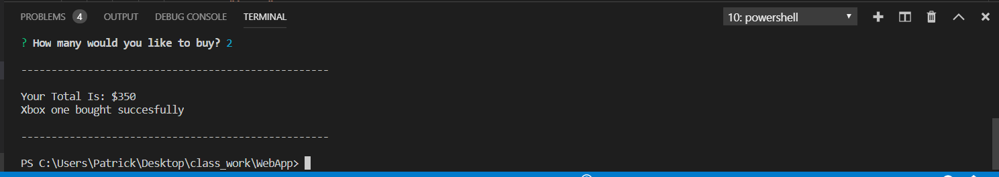
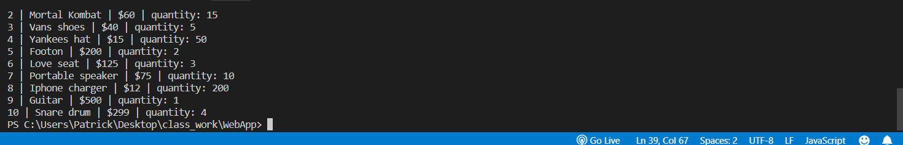
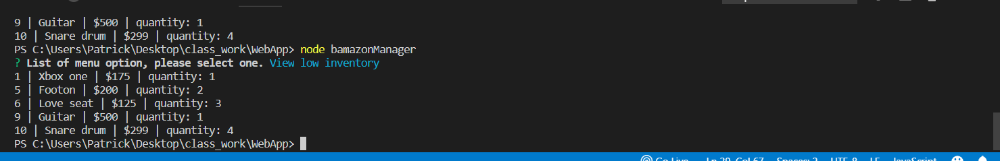
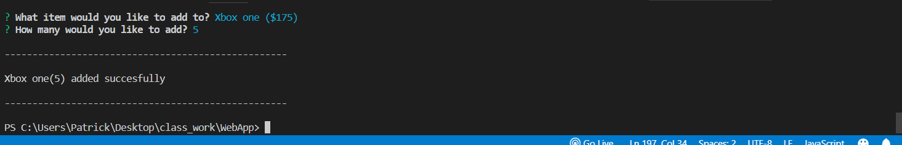
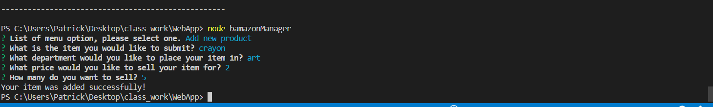

# Bamazon

Bamazon is a functioning node application that allows the user to "purchase items" displayed by the app. It updates the mysql database in realtime. There is a also a manager view which allows the user to view different statistics regarding the products.

---

## Bamazon customer 
`node bamazonCustomer.js`

This will start the app, and display the featured items for sale along with the price. This is done through a query that pulls information from the database. Then after the user selects the item, they are asked how many they want to buy. After that the total is displayed with a message that lets the user know the transaction was successfull. During this the database is updated so that the stock_quantity reflects the new order.

---

## Bamazon Manager View
`node bamazonManager.js>`

Bamazon manager is a node application that allows a manager to query specific data, add new products, and add inventory to already existing products in the database. First the user is proompted with 4 selections: * View Products for Sale, View Low Inventory, Add to Inventory, and Add New Product.View products for sale will show all the products currently listed in the database. View low inventory displays items with inventory less than 5. Add to inventory allows the user to add inventory to already existing products in the database. Add new product allows the user to add new products to the database.

---
View Products For Sale
 

---

View Low Inventory
 

---
Add To Inventory
 

---

Add New Products
 

---

## Built With
Javascript, Node.js, MySQL, Inquirer
---

## Author
**Patrick Caserta**
